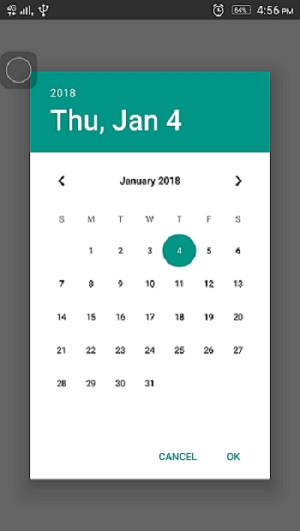

# react-native-datepicker

This repository contains a React Native project, implementing the [react-native-datepicker](https://github.com/xgfe/react-native-datepicker) package.

[Download Apk](./app-debug.apk)

## Installation
## npm install react-native-datepicker --save
### Development

1. Clone this repo.
2. Run `npm install`.
3. Ensure a device, or emulated Android image is connected (`adb devices`).
4. Run `react-native run-android`.
     or
5. Run 'react-native run-ios'.

#### get more detail from [react-native-datepicker](https://github.com/xgfe/react-native-datepicker).

